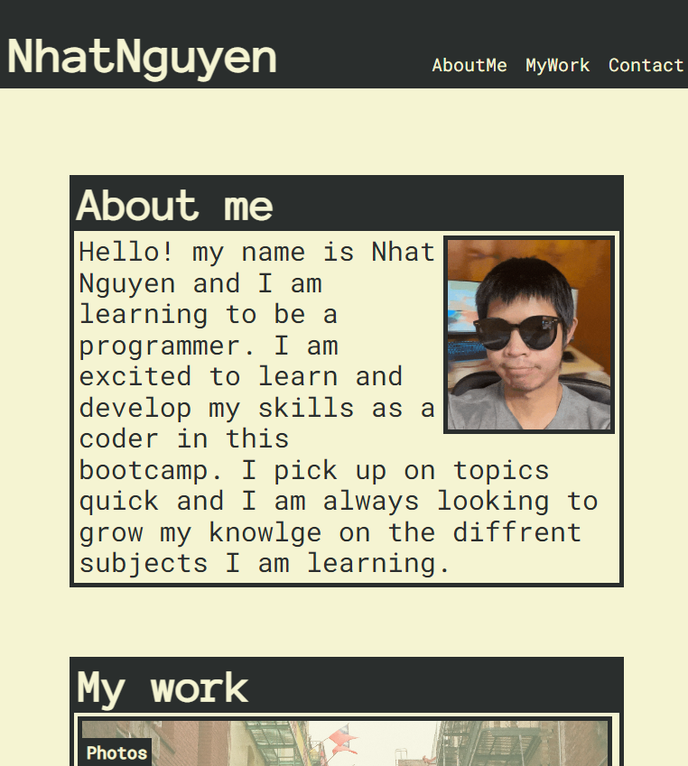

 Portfolio Mockup

## Description

This webpage is a mockup portfolio of work as a coder. The site displays a person's projects and coding experence along with contact information and a bio of themselves.
## Installation

link to the cite: https://nhatwin.github.io/hw-2/

## Usage

This can be used display a coders work experience and kowledge of topics. It gives the user a organized space to keep there body of work. Each section is made to help prospective employers evaluote a persons skill level and work experence.The site also allows for employers to contact the user and links to profiles the user also has. Beyond that, the site was made to practice CSS and HTML during the construction of the site.

## Screenshot

## Credits

N/A

## License

Please refer to the LICENSE in the repo.